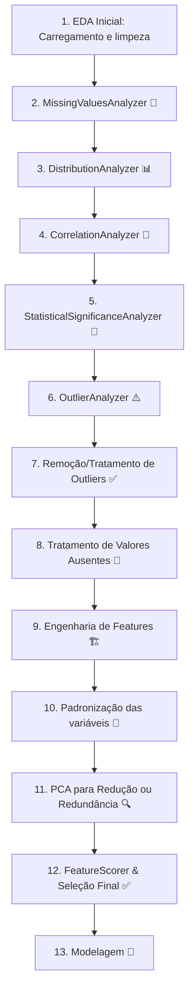

Estou desenvolvendo uma pipeline completa de Análise Exploratória de Dados (EDA) para um dataset com variável alvo binária chamada `y`.

As análises já realizadas foram encapsuladas em módulos reutilizáveis e seguem uma ordem lógica e estratégica no pipeline.

---

### ✅ Etapas da EDA já concluídas:

1. **MissingValuesAnalyzer**  
   - Identifica diferentes tipos de ausência (poucos, muitos, relacionados, target, etc.)
   - Sugere soluções como imputação, MICE, criação de flags

2. **DistributionAnalyzer**  
   - Classifica variáveis numéricas como normal, lognormal, assimétrica, multimodal, etc.
   - Usa skewness e kurtosis para sugerir transformações (log, raiz quadrada, box-cox, padronização)

3. **CorrelationAnalyzer**  
   - Avalia correlação com `y` e entre variáveis
   - Diferencia correlações positivas/negativas (fortes, moderadas, nulas)
   - Indica o sentido e o nível de relevância

4. **StatisticalSignificanceAnalyzer**  
   - Aplica `t-test` ou `Mann-Whitney` para comparar os grupos `y=0` e `y=1`
   - Identifica variáveis com diferença estatística significativa

5. **OutlierAnalyzer**  
   - Detecta outliers com base no método IQR
   - Calcula proporção de outliers e sugere ações: winsorização, transformação, remoção

6. **FeatureScorer**  
   - Consolida todas as análises anteriores
   - Atribui um score total para cada variável com base em múltiplos critérios ponderados
   - Indica quais variáveis devem ser selecionadas (`selecionar=True`) e justifica a decisão

---

### 🧭 Plano de Continuidade: Fluxo Ideal (com EDA incluída)

---

### 🎯 Objetivo Atual do Projeto

Estou na fase de **pré-modelagem**, com foco em preparar os dados para garantir alta qualidade, reduzir ruído e maximizar o valor preditivo das variáveis.

As tarefas em andamento são:

1. **Remoção ou tratamento seletivo de outliers**  
   - Baseado nos resultados do `OutlierAnalyzer`  
   - Para evitar distorções em transformações, PCA e modelos sensíveis

2. **Engenharia de Features**  
   - Aplicar transformações sugeridas pelas distribuições (ex: log, raiz)  
   - Criar novas variáveis com valor preditivo (flags, interações, combinações, grupos)

3. **Aplicação de PCA**  
   - Após padronização  
   - Para reduzir multicolinearidade, detectar redundância e eventualmente comprimir variáveis

---

### ✅ Checklist de Atividades Concluídas

| Etapa | Descrição | Status |
|-------|-----------|--------|
| ✅ | Carregamento e pré-processamento inicial do dataset | ✔️ |
| ✅ | Identificação e categorização de dados ausentes (`MissingValuesAnalyzer`) | ✔️ |
| ✅ | Detecção de tipos de distribuição (`DistributionAnalyzer`) | ✔️ |
| ✅ | Cálculo de skewness/kurtosis | ✔️ |
| ✅ | Análise de correlação (`CorrelationAnalyzer`) | ✔️ |
| ✅ | Classificação da correlação por intensidade e sentido | ✔️ |
| ✅ | Testes estatísticos com `StatisticalSignificanceAnalyzer` | ✔️ |
| ✅ | Detecção de outliers (`OutlierAnalyzer`) | ✔️ |
| ✅ | Consolidação dos insights (`FeatureScorer`) | ✔️ |
| ✅ | Definição do plano de continuidade estruturado | ✔️ |

---

### 🔜 Próximas Etapas do Pipeline

| Etapa | Descrição | Status |
|-------|-----------|--------|
| ⏳ | Remoção/Tratamento de outliers com base na análise anterior | Em andamento |
| ⏳ | Engenharia de features (transformações, interações, novas variáveis) | A iniciar |
| ⏳ | Padronização das variáveis numéricas (ex: z-score, MinMaxScaler) | A iniciar |
| ⏳ | Aplicação de PCA para redução/redundância | A iniciar |
| ⏳ | Seleção final de variáveis com base no PCA + FeatureScorer | A iniciar |
| ⏳ | Construção de modelo baseline | Futuro |
